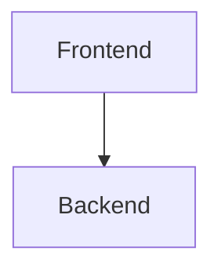

# Architecture Diagrams

## Purpose

This folder contains visual architecture diagrams for AI systems, MLOps pipelines, SaaS platforms, RAG systems, recommendation engines, deployment infrastructure, and cloud-native applications.

The goal is to maintain:

- visual system understanding
- architecture communication
- infrastructure documentation
- engineering clarity
- onboarding simplicity

---

# Why Diagrams Matter

Large systems become difficult to understand through text alone.

Diagrams help visualize:

- data flow
- service communication
- infrastructure dependencies
- scaling strategies
- deployment topology
- ML pipelines

---

# Recommended Diagram Types

| Type | Purpose |
|---|---|
| Flowcharts | process visualization |
| System Diagrams | component relationships |
| Sequence Diagrams | request flow |
| Infrastructure Diagrams | deployment topology |
| Data Flow Diagrams | movement of data |
| Architecture Maps | full-system overview |

---

# Recommended Formats

| Format | Purpose |
|---|---|
| `.mmd` | Mermaid diagrams |
| `.drawio` | Draw.io diagrams |
| `.excalidraw` | Excalidraw sketches |
| `.png` | exported images |
| `.svg` | scalable vector diagrams |

---

# Recommended Folder Structure

```text
diagrams/
│
├── README.md
├── ml-system-design.mmd
├── rag-architecture.mmd
├── recommendation-system.mmd
├── mlops-pipeline.mmd
├── deployment-flow.mmd
├── kubernetes-topology.mmd
├── ci-cd-flow.mmd
└── assets/
```

---

# Mermaid Support

GitHub supports Mermaid diagrams directly inside markdown.

Example:

````markdown

